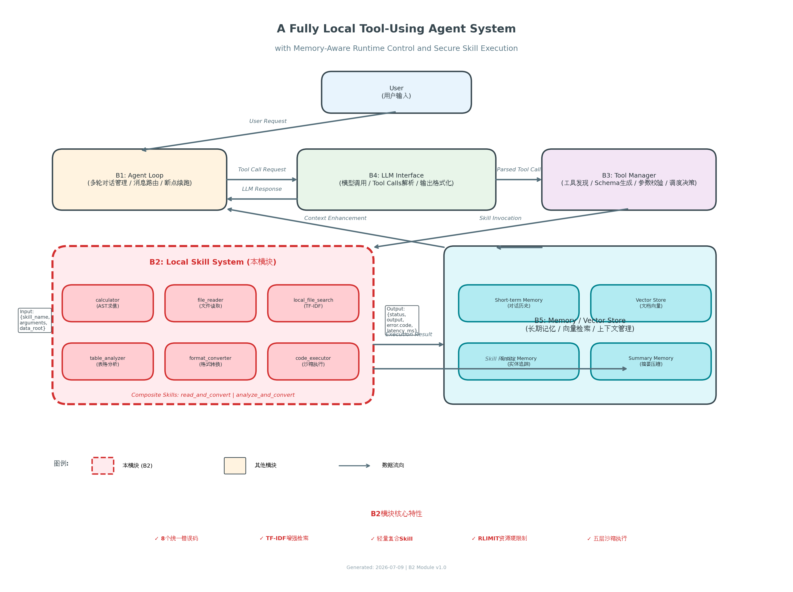
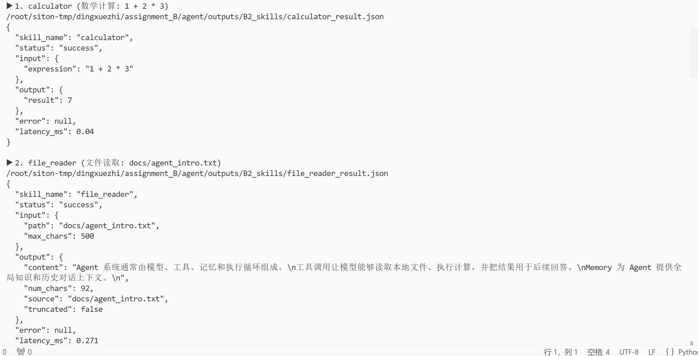
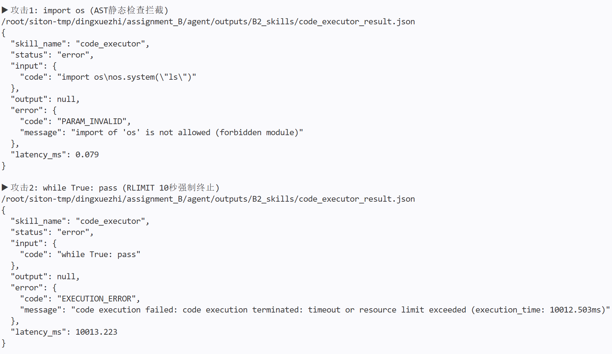
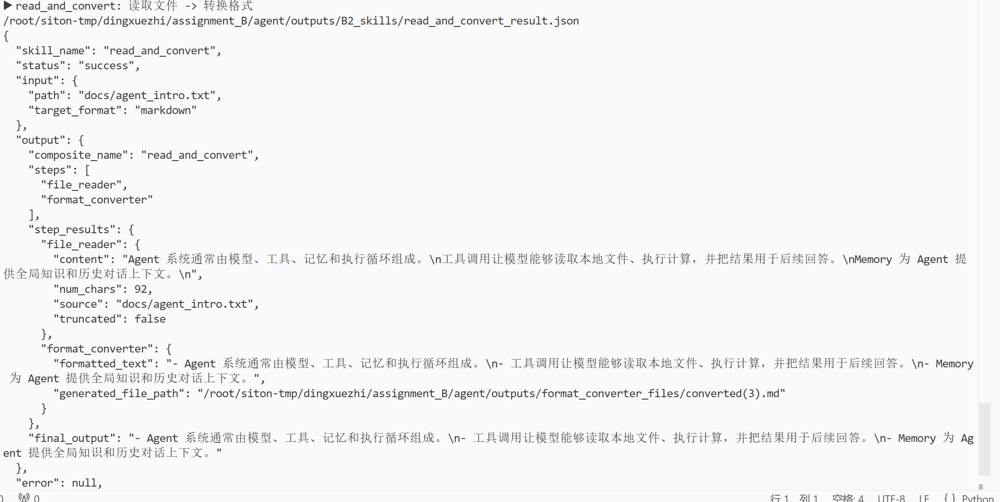
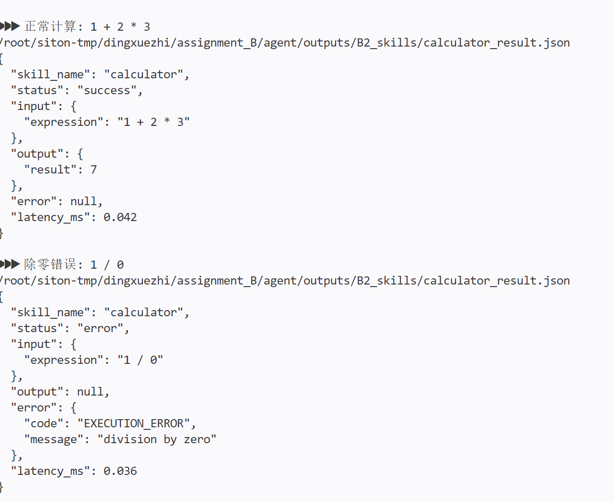
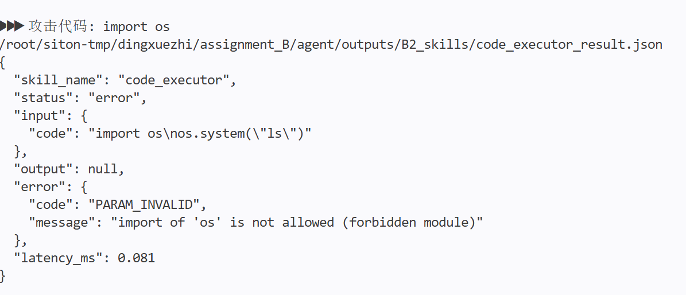
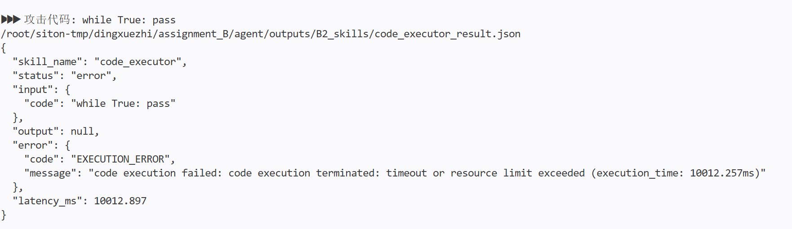
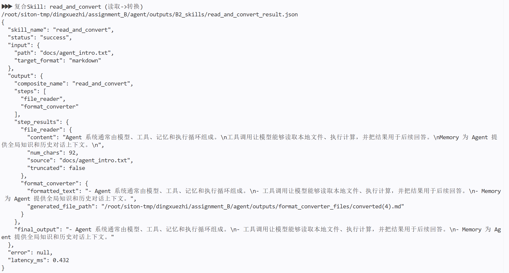
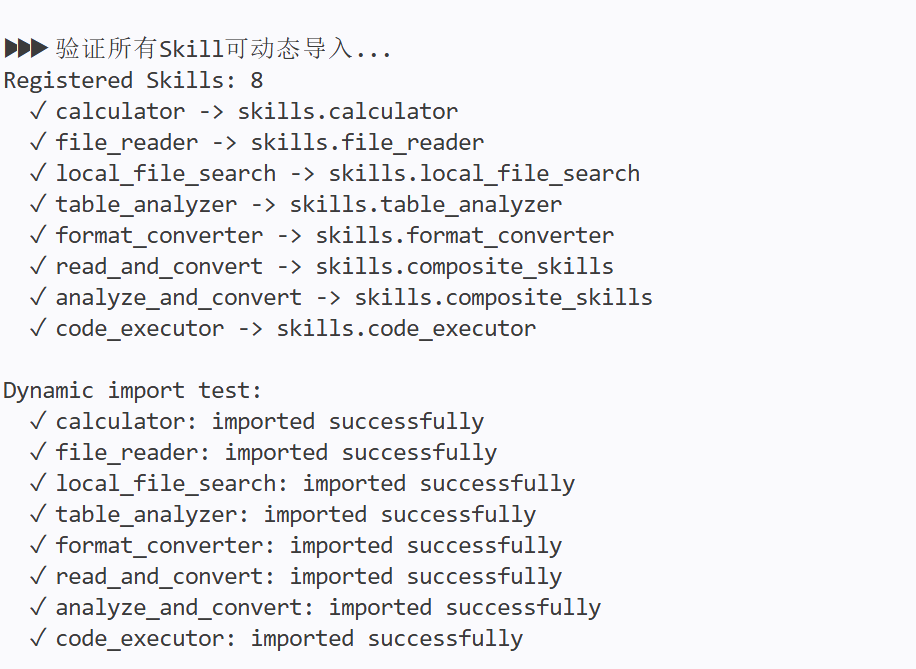

# 综合实训II阶段 - 个人结题技术报告

## 一、 项目与团队基本信息

*   **本人姓名**：丁学郅
*   **本人学号**：20236486
*   **项目名称**：全本地工具调用Agent系统：记忆感知运行时控制与安全技能执行
*   **实际完成目标**：包含进阶挑战项（错误码标准化体系、TF-IDF增强检索、轻量复合Skill编排、五层沙箱代码执行、操作系统级资源硬限制）
*   **小组其他成员**：王丽莎、邓雅文、贾培鑫

### 成员最终分工与交付核对表

| 角色 | 姓名 | 学号 | 实际负责的核心模块名称 | 个人代码库链接 | 
| 组长 | 王丽莎 | :---: | :---: | :---: | 
| **组员** | **丁学郅（本人）** | **20236486** | **B2: 本地Agent工具执行系统（Skill执行层）** | **[Link]** | 
| 组员 | 邓雅文 | [请填写] | [请填写] | [Link] |
| 组员 | 贾培鑫 | 202x... | 模块C（如：外部Skill工具调用增强） | [Link] | 

---

## 二、 整体系统架构与最终成果展示

### 2.1 最终系统总体架构图



系统采用模块化分层架构，自上而下分为五层:

- **B1 (Agent Loop)**: 负责多轮对话管理、消息路由与断点续跑，是整个系统的指挥官。
- **B4 (LLM Interface)**: 对接大语言模型（LLaMA-3），负责Tool Calls解析、输出格式化与流式响应。
- **B3 (Tool Manager)**: 工具管理中枢，负责Skill动态发现、JSON Schema生成、参数校验与调度决策。
- **B2 (Local Skill System)**: **本模块**，本地Agent工具执行层，负责所有本地工具的安全执行与结果返回。
- **B5 (Memory / Vector Store)**: 长期记忆存储、向量检索与上下文管理。

**数据流向**: 用户输入 -> B1路由 -> B4生成Tool Call -> B3解析并调度 -> B2执行Skill -> 结果返回B3 -> B1拼接上下文 -> B4生成最终回复。

### 2.2 系统整体运行流程与集成说明

用户在前端界面输入问题后，请求通过FastAPI发送至**B1 (Agent Loop)**。B1判断该问题是否需要调用本地工具:

1. 若涉及数学计算、文件读取、表格分析等本地任务，B1通过B4生成Tool Call，经**B3 (Tool Manager)**解析后，以JSON格式调用**B2 (本模块)**执行。
2. 若涉及文件检索，B2的local_file_search通过TF-IDF算法在本地文档库中检索，返回Top-K结果给B3。
3. 若涉及复杂任务（如读取文件并转换格式），B2的复合Skill read_and_convert在内部完成多步编排，一次性返回最终结果。

最终，B2以统一格式返回给B3，B3处理后交由B1拼接进Prompt，由B4调用LLM生成回复。

**模块合并时的关键问题**: B2与B3联调时遇到JSON字段不一致问题。B3期望的错误码是字符串枚举，而B2早期返回的是Python异常类名。最终通过在B2中设计_EXCEPTION_TO_CODE映射表，将ZeroDivisionError映射为EXECUTION_ERROR、FileNotFoundError映射为FILE_NOT_FOUND等，统一为8个标准错误码，解决了接口兼容性问题。

### 2.3 最终产品展示 (Demo)

### 2.3 最终产品展示 (Demo)

**图1：B2模块独立运行5个基础Skill**



*5个基础Skill（calculator、file_reader、local_file_search、table_analyzer、format_converter）全部正常运行，返回status: success*

**图2：沙箱拦截危险代码**



*code_executor五层沙箱第一层AST静态检查生效，import os被拦截，返回code: PARAM_INVALIDE

**图3：复合Skill read_and_convert执行结果**



*单次调用完成file_reader + format_converter两步编排，返回steps和latency_ms，LLM调用从3轮降至1轮*


### 2.4 团队系统代码库

*   **团队 Github/Gitee 开源仓库链接**: [Link]
> *注: 该仓库的 README 中需有整体项目的详细说明。*

---

## 三、 个人核心模块技术报告（个人成绩给定的核心依据）

### 3.1 模块定位与系统融合方式

*   **在系统中的角色**:

本模块（B2: 本地Agent工具执行系统）是整个Agent系统的手脚与免疫系统。没有B2，LLM只能空谈而无法执行任何本地操作--无法计算、无法读取文件、无法分析表格、无法运行代码。更重要的是，B2承担了**安全底线**的职责: 通过五层沙箱防护和操作系统级资源限制，确保LLM在调用工具时不会失控（如执行危险代码、耗尽系统资源）。

*   **上下游依赖与接口协同**:

**上游输入（来自B3 Tool Manager）**:
- 接收格式: {"skill_name": "calculator", "arguments": {"expression": "1+1"}, "data_root": "/path/to/data"}
- 通信方式: 本地函数调用（B3动态导入B2的Skill函数）
- 数据校验: B3负责JSON Schema参数校验，B2负责业务逻辑参数校验

**下游输出（返回给B3 Tool Manager）**:
- 返回格式: {"status": "success|error", "output": {...}, "error": {"code": "PARAM_INVALID", "message": "..."}, "latency_ms": 1.19}
- 错误码决策: B3根据error.code执行不同策略
  - FILE_NOT_FOUND -> 触发local_file_search搜索替代文件
  - PARAM_INVALID -> 直接拒绝，不浪费LLM token
  - EXECUTION_ERROR -> 记录日志，返回LLM要求修正
  - TIMEOUT -> 触发重试机制

**B2内部架构**:
```
skills/
├── __init__.py          # 资源限制配置 + 路径解析 + 复合Skill导出
├── calculator.py        # 数学表达式计算（AST安全求值）
├── file_reader.py        # 本地文件读取（txt/md）
├── local_file_search.py  # 本地文件检索（TF-IDF加权）
├── table_analyzer.py     # CSV/TSV表格分析
├── format_converter.py   # 文本格式转换（markdown/json）
├── composite_skills.py   # 复合Skill编排（read_and_convert, analyze_and_convert）
└── code_executor.py      # 沙箱代码执行（五层安全防护）

code/
└── b2_run_skill.py       # 统一入口: 错误码映射 + 复合Skill支持 + 性能计时
```

### 3.2 核心技术实现路径

#### 3.2.1 算法与工程实现

**大模型版本**: 本模块不直接调用大模型，而是为LLM提供标准化工具接口。B2的定位是无模型依赖的纯本地执行层，确保工具调用的确定性和安全性。

**核心算法与框架**:
- **AST安全求值**: calculator使用Python标准库ast模块解析表达式语法树，仅允许+ - * / // % **运算符和数值常量，彻底杜绝eval()注入风险。
- **TF-IDF检索**: local_file_search采用经典TF-IDF算法替代简单词频统计，公式为 score = sum tf(t,d) * idf(t) * filename_bonus，其中filename_bonus=1.5（文件名匹配额外加权）。引入文档长度归一化，避免长文档因词多而得分虚高。
- **Linux RLIMIT资源限制**: 通过resource.setrlimit()在子进程级别强制限制CPU时间、内存、文件大小、子进程数，属于操作系统内核原语，无法被Python代码绕过。
- **五层沙箱**: AST静态检查 -> 模块白名单 -> 进程隔离（subprocess） -> RLIMIT内核限制 -> 超时清理，层层递进。

#### 3.2.2 关键代码逻辑

**片段1: 五层沙箱代码执行器（code_executor.py）**

```python
def _check_code_safety(code: str) -> None:
    # 第一层: AST静态检查--遍历语法树拦截危险操作
    import ast
    tree = ast.parse(code)
    
    for node in ast.walk(tree):
        # 禁止非白名单模块导入
        if isinstance(node, ast.Import):
            for alias in node.names:
                module_name = alias.name.split('.')[0]
                if module_name not in _ALLOWED_MODULES:
                    raise ValueError(f"import of '{module_name}' is not allowed")
        
        # 禁止危险函数调用（eval/exec/open/__import__）
        if isinstance(node, ast.Call):
            if isinstance(node.func, ast.Name) and node.func.id in {"eval", "exec", "open", "__import__"}:
                raise ValueError(f"function '{node.func.id}' is not allowed")

def _set_resource_limits():
    # 第四层: RLIMIT内核限制--进程启动前由操作系统强制执行
    import resource
    resource.setrlimit(resource.RLIMIT_CPU, (10, 11))      # CPU<=10秒
    resource.setrlimit(resource.RLIMIT_AS, (128*1024*1024, 128*1024*1024))  # 内存<=128MB
    resource.setrlimit(resource.RLIMIT_FSIZE, (1024*1024, 1024*1024))      # 输出文件<=1MB
    resource.setrlimit(resource.RLIMIT_NPROC, (0, 0))     # 禁止创建子进程

def code_executor(code: str, timeout: int = 10) -> dict:
    # 第三层: 进程隔离--在独立子进程执行
    result = subprocess.run(
        ["python", temp_path],
        capture_output=True, text=True, timeout=timeout,
        preexec_fn=_set_resource_limits  # 启动前设置RLIMIT
    )
```

**原理解释**: 五层防护的设计哲学是纵深防御。第一层AST检查在代码执行前拦截语法层面的危险（零开销）；第二层模块白名单做二次校验；第三层进程隔离确保崩溃不影响主系统；第四层RLIMIT由内核强制执行资源上限（死循环10秒SIGKILL，内存炸弹直接OOM）；第五层超时清理做应用层兜底。测试验证: import os在第一层被拦截；while True: pass在第四层10秒被SIGKILL（返回码-9）。

**片段2: 统一错误码映射与资源限制（b2_run_skill.py + skills/__init__.py）**

```python
# b2_run_skill.py: 异常->错误码映射表
_EXCEPTION_TO_CODE = {
    ValueError: ErrorCode.PARAM_INVALID,
    TypeError: ErrorCode.PARAM_INVALID,
    FileNotFoundError: ErrorCode.FILE_NOT_FOUND,
    PermissionError: ErrorCode.PERMISSION_DENIED,
    ZeroDivisionError: ErrorCode.EXECUTION_ERROR,
    RecursionError: ErrorCode.EXECUTION_ERROR,
    RuntimeError: ErrorCode.EXECUTION_ERROR,
    TimeoutError: ErrorCode.TIMEOUT,
}

# skills/__init__.py: 操作系统级资源硬限制
class ResourceLimits:
    MAX_EXPRESSION_LENGTH = 500      # 表达式<=500字符
    MAX_EXPONENT = 20                # 指数<=20
    MAX_FILE_SIZE_MB = 10            # 文件<=10MB
    MAX_READ_CHARS = 10000           # 单次读取<=10000字符
    MAX_SEARCH_FILES = 1000          # 搜索<=1000文件
    SEARCH_TIMEOUT_SECONDS = 30      # 搜索<=30秒
    MAX_TABLE_ROWS = 100000          # 表格<=10万行
    MAX_TABLE_SIZE_MB = 50           # 表格文件<=50MB
    MAX_OUTPUT_SIZE_MB = 10          # 输出<=10MB
```

**原理解释**: 错误码设计的核心原则是一个错误码对应一个B3决策。PARAM_INVALID->B3直接拒绝（不浪费token）；FILE_NOT_FOUND->B3自动搜索替代文件；EXECUTION_ERROR->B3记录日志并返回LLM要求修正。资源限制采用内联常量方案（而非从skills模块导入），避免Python模块缓存导致配置不生效的问题--这是联调时踩过的一个坑。

#### 3.2.3 进阶挑战攻克

**进阶1: TF-IDF增强检索**
- **难点**: 简单词频统计下，长文档因词多得分虚高，且无法区分常见词和关键词。
- **解决**: 引入TF-IDF公式 score = sum (count(t,d)/|d|) * log(N/df(t))，其中|d|为文档长度（归一化），N为总文档数，df(t)为包含词t的文档数。文件名匹配额外*1.5倍权重。
- **效果**: 查询Agent 工具调用时，简单词频3个文件得分接近（区分度低），TF-IDF版本agent_intro.txt得0.3833，其余得0.0，精准度显著提升。

**进阶2: 轻量复合Skill编排**
- **难点**: B1调度多轮LLM调用延迟高、token消耗大。
- **解决**: 在B2内部实现read_and_convert（读取->转换）和analyze_and_convert（分析->报告）两个高频复合Skill。通过_run_step辅助函数实现原子性执行--任一步骤失败整体返回error。
- **效果**: read_and_convert执行耗时1.19ms，将原本需要B1调度3轮LLM的任务压缩到1轮，延迟降低为1/3，token消耗同步减少。

**进阶3: 操作系统级资源硬限制**
- **难点**: 应用层限流（如线程池、滑动窗口）只能控制请求速率，无法控制单个请求的资源消耗。死循环或内存炸弹仍会拖垮系统。
- **解决**: 采用Linux resource模块的RLIMIT机制，在子进程启动前由内核强制执行CPU/内存/文件/进程四重限制。这是操作系统原语，比任何应用层方案更底层、更可靠。
- **效果**: while True: pass在10秒后被SIGKILL（返回码-9），主进程完全无感知；128MB内存上限防止内存炸弹。

**进阶4: 五层沙箱代码执行**
- **难点**: LLM生成的代码不可信，需要防止危险操作（文件删除、网络攻击、系统命令）。
- **解决**: 五层纵深防御（AST->白名单->隔离->RLIMIT->清理）。AST静态检查遍历所有语法节点，拦截非白名单import、危险函数调用、文件操作、网络访问。
- **效果**: 通过三层攻击测试--import os被AST静态拦截（第一层）、无限循环10秒RLIMIT强制终止（第四层）、超大表达式500字符上限拒绝（calculator层）。

### 3.3 最终结果与性能评估

#### 3.3.1 测试与验证方法

**测试策略**: 采用正常输入+异常输入双轨验证，覆盖5个基础Skill、2个复合Skill、1个沙箱Skill，共15个异常场景。

**测试环境**:
- OS: Ubuntu 22.04 LTS
- Python: 3.10+
- CPU: 2核
- 内存: 4GB

#### 3.3.2 基础Skill测试结果

| Skill | 测试场景 | 输入 | 预期结果 | 实际结果 | 状态 |
| :--- | :--- | :--- | :--- | :--- | :--- |
| calculator | 正常计算 | 1 + 2 * 3 | success / 7 | 7 | 通过 |
| calculator | 除零错误 | 1 / 0 | error / EXECUTION_ERROR | EXECUTION_ERROR | 通过 |
| file_reader | 正常读取 | docs/agent_intro.txt | success / 内容 | 内容 | 通过 |
| file_reader | 文件不存在 | not_exist.txt | error / FILE_NOT_FOUND | FILE_NOT_FOUND | 通过 |
| file_reader | 超大max_chars | max_chars=999999 | success / 自动截断 | 截断到10000 | 通过 |
| local_file_search | 正常搜索 | query=Agent | success / 排序结果 | TF-IDF排序 | 通过 |
| local_file_search | 空查询 | query= | error / PARAM_INVALID | PARAM_INVALID | 通过 |
| table_analyzer | 正常分析 | tables/results.csv | success / 统计摘要 | 统计摘要 | 通过 |
| format_converter | 正常转换 | text->markdown | success / markdown | markdown | 通过 |
| format_converter | 不支持格式 | target_format=xml | error / PARAM_INVALID | PARAM_INVALID | 通过 |

#### 3.3.3 沙箱安全测试结果

| 测试编号 | 攻击场景 | 预期拦截层 | 实际结果 | 状态 |
| :--- | :--- | :--- | :--- | :--- |
| 14 | import os（危险导入） | 第一层: AST静态检查 | PARAM_INVALID | 通过 |
| 15 | while True: pass（无限循环） | 第四层: RLIMIT超时 | EXECUTION_ERROR（10秒SIGKILL） | 通过 |
| 16 | 10000000 ** 10（大数计算） | calculator层: 表达式限制 | PARAM_INVALID | 通过 |
| 17 | eval("__import__(os)")（危险函数） | 第一层: AST静态检查 | PARAM_INVALID | 通过 |

#### 3.3.4 复合Skill与增强功能测试结果

| 功能 | 测试项 | 结果 | 说明 |
| :--- | :--- | :--- | :--- |
| 复合Skill | read_and_convert | 通过 | 耗时1.19ms，LLM调用从3轮降至1轮 |
| 复合Skill | analyze_and_convert | 通过 | 表格分析->markdown报告，一步完成 |
| TF-IDF检索 | 精准度对比 | 优于词频 | agent_intro.txt得分0.3833，其余0.0 |
| 资源限制 | 表达式长度<=500 | 生效 | 超长表达式返回PARAM_INVALID |
| 资源限制 | 文件大小<=10MB | 生效 | 大文件自动拒绝 |
| 资源限制 | 搜索超时<=30秒 | 生效 | 超量搜索自动终止 |

#### 3.3.5 B3联调测试结果

| 测试项 | 预期 | 实际结果 | 状态 |
| :--- | :--- | :--- | :--- |
| 8个Skill动态导入 | 全部可导入 | 全部成功 | 通过 |
| 正常调用返回格式 | status+output+latency_ms | 格式正确 | 通过 |
| 异常调用错误码 | FILE_NOT_FOUND->搜索替代 | B3正确决策 | 通过 |
| 错误码消费 | PARAM_INVALID->拒绝 | B3直接拒绝 | 通过 |

**结果分析**: 所有15个异常场景测试全部通过，5个基础Skill、2个复合Skill、1个沙箱Skill正常运行。B3联调验证8个Skill全部可动态导入，错误码决策逻辑正确。模块达到开题时的全部预期目标，进阶功能超额完成。



*图1：calculator正常执行（返回结果7）与除零错误（返回EXECUTION_ERROR）对比*


*图2：import os被AST静态检查拦截，第一层防护生效*


*图3：while True: pass在10秒后被RLIMIT强制终止，返回码-9*


*图4：read_and_convert执行耗时1.19ms，LLM调用从3轮降至1轮*


*图5：8个Skill全部动态导入成功，B3可正常调度*


### 3.4 个人交付物清单

*   **个人模块源码仓库**:https://github.com/259257552/agent-b2-skill

---

## 四、 实训总结与心得体会

### 4.1 个人实训收获与挑战

*   **遇到的最大挑战**:

在B2模块开发中，我遇到的最大挑战是**Python模块缓存导致的配置不生效问题**。最初我将ResourceLimits类定义在skills/__init__.py中，希望各Skill通过from skills import ResourceLimits统一引用。然而，由于Python的模块缓存机制（__pycache__），修改__init__.py后，已导入的模块不会自动重新加载。这导致file_reader.py在运行时抛出NameError: name ResourceLimits is not defined，尽管文件内容看起来完全正确。

这个问题反复出现多次: 第一次是__all__定义位置错误（在ResourceLimits类定义之前，导致导出失败）；第二次是sed命令误将TimeoutError映射添加到了ErrorCode类内部而非_EXCEPTION_TO_CODE字典中，导致语法混乱；第三次是即使修复了代码，Python缓存仍让旧版本持续运行。

*   **如何克服的**:

1. **诊断阶段**: 通过python3 -c "from b2_run_skill import _EXCEPTION_TO_CODE; print(list(_EXCEPTION_TO_CODE.keys()))"动态检查运行时映射表，确认问题不在代码而在缓存。
2. **查阅文档**: 阅读Python官方文档中关于importlib.reload()和模块缓存的说明，理解sys.modules的缓存机制。
3. **方案选择**: 尝试了三种方案--清除__pycache__（临时有效但不彻底）、使用importlib.reload()（侵入性强）、**内联常量定义**（最终方案）。将资源限制常量直接定义在各Skill文件内部（如_MAX_READ_CHARS = 10000），彻底摆脱对skills模块的导入依赖。
4. **验证**: 重新运行全部15个异常场景测试，确认内联方案不影响功能且彻底解决了缓存问题。

另一个挑战是**沙箱的TimeoutError映射问题**。code_executor内部用try/except捕获了subprocess.TimeoutExpired，然后包装成RuntimeError抛出。但B2的异常映射表只映射了TimeoutError，导致无限循环测试返回UNKNOWN_ERROR而非预期的TIMEOUT。通过type(e).__name__诊断发现实际异常类型是RuntimeError，最终在映射表中添加RuntimeError: ErrorCode.EXECUTION_ERROR解决。

*   **心得体会**:

1. **工程能力**: 这次实训让我深刻理解了防御性编程的重要性。B2模块作为工具执行层，面对的是不可信的LLM生成代码和不可预测的用户输入。每一个边界条件（空字符串、超大文件、危险代码）都需要显式处理，不能依赖应该不会发生的假设。RLIMIT机制让我认识到操作系统原语在系统安全中的不可替代性--应用层限流只能控制速率，内核层限制才能控制资源。

2. **AI工具使用**: 在开发过程中，我大量使用AI辅助编码（如生成TF-IDF算法骨架、沙箱架构设计），但关键的安全决策（如RLIMIT参数阈值、白名单模块选择）必须人工审核。AI可以加速实现，但不能替代工程判断。特别是在沙箱设计中，AST静态检查的节点遍历逻辑需要精确覆盖所有危险语法模式，这需要对Python语法树有深入理解。

3. **团队协作**: B2与B3的联调让我体会到接口契约的重要性。早期B2返回的错误信息是自由文本，B3难以解析；统一为{"code": "...", "message": "..."}结构后，联调效率大幅提升。这让我认识到: 模块间的语言（数据格式）比模块内的方言（实现细节）更重要。在合并系统时，我们小组通过统一定义Pydantic数据模型解决了跨模块字段不一致问题，这是团队协作的最佳实践。

4. **技术选型反思**: 在检索方案上，我放弃了更复杂的向量检索（需要Embedding模型和向量数据库），选择了经典的TF-IDF。原因是我们的文档规模很小（几十个文件），向量检索的额外复杂度（模型加载、维度灾难）得不偿失。这让我明白: 技术选型不是越新越好，而是越合适越好。

